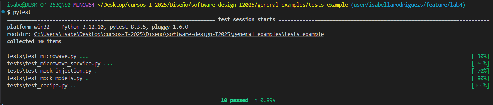

# Laboratorio 4 - Pruebas Unitarias y CI/CD

**Nombre:** Isabella Rodríguez Sánchez

**Carnet:** C26701

### Artefacto nuevo: `MicrowaveArtifact`

Se implementó la clase `MicrowaveArtifact` que extiende `ICookingArtifact`. A diferencia de otros artefactos como el horno o el air fryer, el microondas tiene estas funcinalidades:

- Si el tiempo de cocción es mayor a 60 minutos, el estado se marca como `"error"`.
- Si es menor a 3 minutos, el estado es `"warming"`.
- En otros casos, el estado es `"cooked"`.

Este diseño permite validar distintos flujos de ejecución y estados, siguiendo el principio de sustitución de Liskov y favoreciendo el polimorfismo.

---

### Servicio nuevo: `MicrowaveCookingService`

Se implementó un nuevo servicio `MicrowaveCookingService`, siguiendo la interfaz `ICookingService`, y utilizando inyección de dependencias con la clase `Recipe`.

Este servicio:

- Cocina todos los artefactos con `cook_all(minutes)`.
- Luego obtiene los estados y si alguno tiene el estado `"error"`, devuelve un mensaje de fallo.
- Si no hay errores, devuelve un mensaje de éxito con los minutos utilizados.

Este comportamiento muestra cómo los servicios pueden tomar decisiones basadas en los estados de los artefactos, respetando el principio de inversión de dependencias.

---

### Pruebas realizadas

Se implementaron las siguientes pruebas:

- **Artefacto `MicrowaveArtifact`**:
  - Cocción normal (estado `cooked`)
  - Tiempo corto (estado `warming`)
  - Tiempo excesivo (estado `error`)

- **Servicio `MicrowaveCookingService`**:
  - Verifica respuesta correcta si todo está bien.
  - Reporta correctamente el estado de los artefactos.
  - Detecta errores si se cocinó demasiado tiempo.

Estas pruebas siguen buenas prácticas de unit testing y están aisladas entre sí.

---

### CI/CD Pipeline con GitHub Actions

Un pipeline de CI/CD (Integración Continua / Entrega Continua) permite ejecutar pruebas de forma automática cada vez que se suben cambios al repositorio (por ejemplo, mediante `git push` o `pull request`). Esto ayuda a detectar errores a tiempo y asegurar que el código se mantiene estable y funcional.

En este laboratorio, podría configurarse fácilmente un pipeline con GitHub Actions para ejecutar todos los tests automáticamente usando `pytest`.

---

### Buenas prácticas aplicadas

- Principios SOLID (especialmente Inversión de Dependencias y Abierto/Cerrado).

- Inyección de dependencias.

- Uso de interfaces para permitir mocks y testeo desacoplado.

- Tests unitarios claros, repetibles y relevantes.