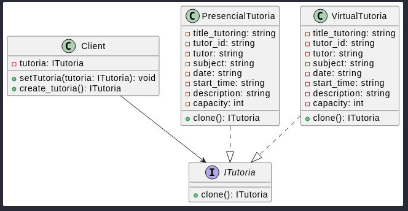

# Patrón: Prototype
### Definición del patrón y a qué tipo pertenece

El Patrón Prototype es un patrón creacional que permite generar nuevos objetos mediante la copia (clonado) de un objeto existente, llamado prototipo, en lugar de instanciarlos directamente.

Este patrón es útil cuando la creación de objetos es costosa en términos de recursos o complejidad. La idea central es definir una interfaz con un método clone(), que cada clase concreta implementará según sus necesidades.

   

### ¿Cuál es el problema común que resuelve?

Durante el desarrollo de software es común necesitar:

- Crear objetos complejos o costosos de inicializar.
- Instanciar clases sin conocer su clase concreta exacta (por ejemplo, cuando se trabaja con interfaces o clases base).
- Evitar la duplicación de código al construir objetos similares.

El patrón Prototype resuelve esto al permitir la creación de objetos mediante la clonación de un objeto ya configurado, evitando así inicializaciones repetidas y dependencias a clases concretas.

### ¿Cómo mejora el mantenimiento o escalabilidad del sistema?

- Reduce el acoplamiento: ya que no se depende de clases concretas para crear objetos. *(Mantenimiento)*

- Aumenta la flexibilidad: nuevos tipos de objetos se pueden agregar fácilmente sin modificar el código cliente. *(Escalabilidad)*

- Evita código repetido: permite reutilizar la configuración de un prototipo para generar otros objetos similares. *(Mantenimiento)*

- Facilita la creación de objetos complejos: al clonar un prototipo ya configurado. *(Escalabilidad)*

### Otras ventajas

- Puedes clonar objetos sin acoplarlos a sus clases concretas.

- Evita código de inicialización repetitivo al reutilizar prototipos prefabricados.

- Ideal para sistemas donde se crean muchas instancias similares.

### Desventajas

Clonar objetos complejos con referencias circulares puede ser complicado.
Ejemplos típicos:

- Amigos en una red social (referencias mutuas).

- Árboles donde padres e hijos se referencian mutuamente.

- Listas circulares.

En lenguajes como C++, donde el manejo de memoria es manual, estos ciclos pueden provocar:

- Fugas de memoria si no se usan destructores apropiados o punteros inteligentes.

- Ciclos infinitos si el clonado no controla objetos ya copiados.

### Posibles soluciones:

- Usar punteros inteligentes (shared_ptr y weak_ptr) para evitar ciclos fuertes.

- Usar estructuras auxiliares (como mapas) para registrar objetos ya clonados.

- Serializar objetos como alternativa al clonado profundo directo.

## Ejemplo de aplicación del patrón Prototype en una página de tutorías

Supongamos que estamos desarrollando una página de tutorías donde los estudiantes pueden buscar tutores para diferentes materias. En este caso, podríamos usar el patrón Prototype para clonar objetos de tutor configurados previamente, en lugar de crear nuevos objetos desde cero cada vez.

### Escenario

En la página de tutorías, cada tutor tiene un perfil que incluye información como:
- Nombre
- Materia(s) que enseña
- Disponibilidad
- Tarifa por hora

En lugar de crear un nuevo objeto Tutor para cada solicitud, podemos tener prototipos preconfigurados para tutores de diferentes materias y clonar estos prototipos según sea necesario.

### Ventajas
- **Escalabilidad**: Permite agregar nuevos prototipos para diferentes tipos de tutorías sin modificar el código existente.
- **Mantenimiento**: Evita duplicar código al reutilizar prototipos preconfigurados.

Este enfoque es especialmente útil en sistemas donde se crean muchas instancias similares, como las tutorías en una plataforma educativa.

### Diagrama del Patrón Prototype

A continuación, se presenta un diagrama que ilustra la implementación del patrón Prototype en este proyecto:

 ### Bibliografía 
 Geoks for Geeks. (2025). Prototype Design Pattern. https://www.geeksforgeeks.org/prototype-design-pattern/ 
 Shvets A. (2021). Sumérgete en los patrones de diseño.

