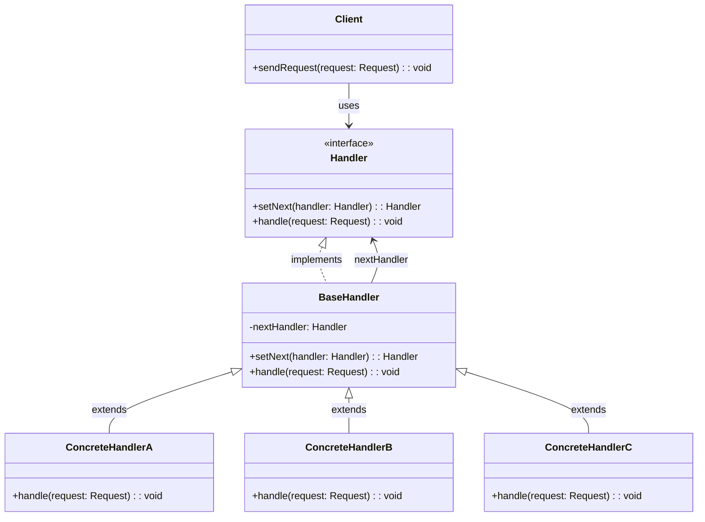

# Demostración del Patrón de Diseño Chain of Responsibility

Este proyecto ilustra el patrón de diseño Chain of Responsibility utilizando un escenario de sistema de soporte técnico, donde diferentes manejadores (handlers) procesan diferentes tipos de problemas técnicos.

## Estructura del Proyecto

```bash
src/
├── models/
│   └── Request.ts         # Define la interfaz Request para representar una solicitud
├── handlers/
│   ├── Handler.ts         # Define la interfaz Handler
│   ├── BaseHandler.ts     # Implementa la interfaz Handler y proporciona funcionalidad común
│   ├── SoftwareIssueHandler.ts  # Handler concreto para problemas de software
│   ├── HardwareIssueHandler.ts  # Handler concreto para problemas de hardware
│   └── NetworkIssueHandler.ts   # Handler concreto para problemas de red
├── client/
│   └── Client.ts          # Define la clase Client que utiliza la cadena de handlers
└── index.ts               # Punto de entrada que demuestra el patrón en acción
```

## Manual de Uso del Programa

### Requisitos Previos

- Node.js (versión 12 o superior)
- npm (viene con Node.js)

### Instalación

1. Clone el repositorio o descargue el código fuente.
2. Navegue al directorio del proyecto.
3. Instale las dependencias:

   ```bash
   npm install
   ```

### Ejecución del Programa

Para ejecutar la demostración del patrón Chain of Responsibility, use cualquiera de los siguientes comandos:

1. Usando el script npm definido en package.json:

   ```bash
   npm run dev
   ```

2. Usando ts-node directamente:

   ```bash
   npx ts-node src/index.ts
   ```

3. Compilando y ejecutando:

   ```bash
   npm run build
   npm start
   ```

### Salida Esperada

El programa mostrará la demostración del patrón Chain of Responsibility procesando diferentes tipos de solicitudes:

- Una solicitud de problema de software (manejada por SoftwareIssueHandler)
- Una solicitud de problema de hardware (manejada por HardwareIssueHandler)
- Una solicitud de problema de red (manejada por NetworkIssueHandler)
- Una solicitud de problema de base de datos (no manejada por ningún handler)

## Explicación Teórica del Patrón Chain of Responsibility

### Definición

El patrón Chain of Responsibility es un patrón de diseño comportamental que permite que una solicitud pase a través de una cadena de objetos manejadores (handlers). Al recibir una solicitud, cada manejador decide si la procesa o la pasa al siguiente manejador en la cadena.

### Propósito

- Evitar el acoplamiento entre el emisor de una solicitud y su receptor.
- Permitir que más de un objeto tenga la oportunidad de manejar una solicitud.
- Distribuir responsabilidades entre varios objetos, donde cada uno maneja lo que es capaz de procesar.

### Estructura del Patrón

1. **Handler (Interfaz)**: Define una interfaz para manejar solicitudes y opcionalmente un enlace al siguiente handler.
2. **BaseHandler (Clase Abstracta)**: Implementa la interfaz Handler, proporciona funcionalidad común y maneja la lógica de pasar solicitudes al siguiente handler.
3. **ConcreteHandlers (Clases Concretas)**: Implementan el comportamiento específico para manejar solicitudes particulares.
4. **Client (Cliente)**: Inicia la solicitud a un objeto handler en la cadena.

### Flujo de Ejecución

1. El cliente envía una solicitud a la cadena a través del primer handler.
2. Cada handler evalúa si puede manejar la solicitud:
   - Si puede manejarla, la procesa y finaliza.
   - Si no puede, pasa la solicitud al siguiente handler en la cadena.
3. Si ningún handler puede procesar la solicitud, puede quedar sin manejar o ser manejada por un handler predeterminado al final de la cadena.

### Implementación en este Proyecto

En el ejemplo de sistema de soporte técnico:

- **Request**: Representa un problema técnico con un tipo y descripción.
- **Handler (Interfaz)**: Define los métodos `setNext()` y `handle()` que todos los handlers deben implementar.
- **BaseHandler**: Implementa la lógica de pasar la solicitud al siguiente handler y define métodos abstractos `canHandle()` y `processRequest()`.
- **Handlers Concretos**: 
  - `SoftwareIssueHandler`: Maneja problemas de tipo "SOFTWARE".
  - `HardwareIssueHandler`: Maneja problemas de tipo "HARDWARE".
  - `NetworkIssueHandler`: Maneja problemas de tipo "NETWORK".
- **Client**: Configura la cadena de handlers y envía solicitudes a través de ella.

### Ventajas del Patrón

- **Desacoplamiento**: Separa el emisor de una solicitud de los objetos que la manejan.
- **Responsabilidad Única**: Cada handler se enfoca en un tipo específico de solicitud.
- **Flexibilidad**: Se pueden añadir o reordenar handlers sin modificar el código del cliente.
- **Principio de Open/Closed**: Se pueden añadir nuevos handlers sin modificar el código existente.

### Desventajas del Patrón

- No garantiza que una solicitud sea manejada.
- Puede introducir cierta sobrecarga en el procesamiento de solicitudes.

### Relación con el Diagrama de Clases

El diagrama de clases proporcionado ilustra la estructura del patrón:

- La interfaz `Handler` define el contrato para todos los handlers.
- La clase abstracta `BaseHandler` implementa la interfaz y maneja la lógica de la cadena.
- Las clases concretas extienden `BaseHandler` para manejar tipos específicos de solicitudes.
- La clase `Client` utiliza la cadena para procesar solicitudes.

La nota en el diagrama sobre el método `handle(request)` refleja el núcleo del patrón: primero se intenta manejar la solicitud localmente, y si no es posible, se pasa al siguiente handler en la cadena.

## Diagrama de Clases


