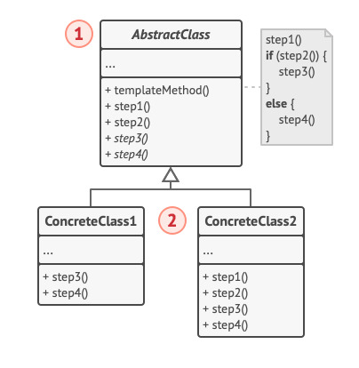

# Template Method

* Universidad de Costa Rica
* Diseño de Software
* Angel Mena Coudin | C34789
* angel.mena@ucr.ac.cr

## Definición y tipo

Template method es una forma de organizar tareas que manejan funcionalidades similares, pero con pequeñas diferencias en su implementación.

Template method define el "esqueleto" de un algoritmo mediante una clase abstracta, dejando que las clases que hereden de este implementen algunos pasos específicos del algoritmo sin cambiar su estructura.

Es de tipo "Behavioral" debido a que está enfocado en el flujo y la secuencia del comportamiento de un programa.

Importante: La clase abstracta tiene un método "templateMethod" que no se puede modificar, este es el que llama a las demás funciones, y de ser necesario, son estas otras funciones las que se modifican.

## Problema que resuelve

Evita la duplicación del código.

## Mejoras en rendimiento y escalabilidad del sistema

Aporta a mantener un código limpio, y al manejo de algunos principios SOLID, como Single Responsibility Principle, entre otros.

## Ventajas y desventajas

Template method es muy breve en cuanto a sus ventajas y desventajas.

### Ventajas

* Evita la duplicación de código; el código que varía en cada subclase permanece en cada una.
* Código reutilizableM; cómo trabaja con herencia, su funcionalidad es reutilizable.
* Flexible; el patrón permite que las subclases decidan cómo implementar los pasos.

### Desventajas

* Debido a que trabaja con herencia si alguna subclase por alguna razón no ocupa un paso que otras sí, este está obligado a implementarlo de igual forma.

## Ejecutar

Desde la raíz de la aplicación, directorio "template_method"
Ejecutar main:

* Make o make run

Ejecutar pruebas:

* Make test

o manualmente

* python app/main.py

* pytest tests/test_build_house.py

## Referencias

* Alvarez, O. D. G., Larrea, N. P. L., & Valencia, M. V. R. (2022). Análisis comparativo de Patrones de Diseño de Software. Polo del Conocimiento: Revista científico-profesional, 7(7), 2146-2165.

* Template method. (n.d.). https://refactoring.guru/es/design-patterns/template-method